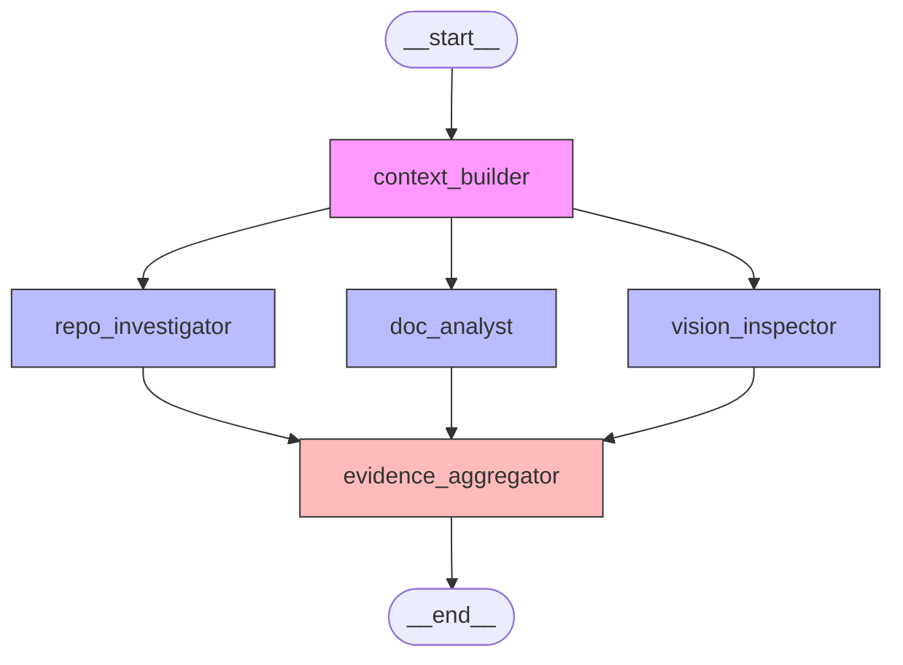

# Phase 0–1 Summary Report

**Project:** Swarm Auditor – Digital Courtroom  
**Date:** $(date)  
**Scope:** Phase 0 (Infrastructure) + Phase 1 (Detective Layer)

---

## 1. What Was Built

### Phase 0: Infrastructure
- **Project scaffold** via `uv` with Python 3.13.7, 67 packages
- **Pydantic models** (`src/state.py`): `Evidence`, `JudicialOpinion`, `CriterionResult`, `AuditReport`, `RubricDimension`, `AgentState` (TypedDict with `Annotated` reducers)
- **Machine-readable rubric** (`rubric.json`): 10 dimensions + 5 synthesis rules (v3.0.0)
- **Skeleton LangGraph StateGraph** (`src/graph.py`): compilable, typed
- **Streamlit shell** (`app.py`): sidebar inputs, 3-tab layout
- **.env.example, .gitignore, README.md**

### Phase 1: Detective Layer
- **RepoInvestigator** (`src/tools/repo_tools.py`): 7 forensic protocols via pure Python AST + subprocess
  - `analyze_git_forensics` — commit count, progression, bulk upload detection
  - `analyze_state_definitions` — BaseModel, TypedDict, Annotated reducers
  - `analyze_graph_structure` — StateGraph, add_node, add_edge, fan-out/fan-in
  - `analyze_tool_safety` — tempfile, os.system, subprocess usage
  - `analyze_structured_output` — with_structured_output, bind_tools, retry logic
  - `analyze_judicial_nuance` — persona detection
  - `analyze_chief_justice` — deterministic rules, markdown output

- **DocAnalyst** (`src/tools/doc_tools.py`): PDF parsing via PyMuPDF
  - `ingest_pdf` — chunked text + image extraction
  - `analyze_theoretical_depth` — 4 themes: Dialectical Synthesis, Fan-In/Fan-Out, Metacognition, State Synchronization
  - `analyze_report_accuracy` — cross-reference PDF file paths vs actual repo files

- **VisionInspector** (`src/tools/vision_tools.py`): Placeholder for Phase 2 multimodal analysis
  - `analyze_diagrams` — extracts images, reports counts

- **Detective Nodes** (`src/nodes/detectives.py`): 3 LangGraph node functions
  - `repo_investigator(state)` → dispatches 7 protocols, collects `_repo_file_list`
  - `doc_analyst(state)` → runs `theoretical_depth` + `report_accuracy`
  - `vision_inspector(state)` → runs `analyze_diagrams` placeholder

- **Parallel Fan-Out/Fan-In Graph** (`src/graph.py`):
  ```
  START → context_builder → [repo_investigator ‖ doc_analyst ‖ vision_inspector] → evidence_aggregator → END
  ```

- **Enhanced Streamlit UI** (`app.py`):
  - Real graph execution on button click
  - Progress indicators per detective
  - Evidence tab with per-dimension expanders
  - Raw JSON view
  - Architecture Mermaid diagram

---

## 2. Architecture Diagram



---

## 3. Test Coverage

| Test File             | Tests | Status |
|-----------------------|------:|--------|
| `test_state.py`       |    17 | ✅ All pass |
| `test_repo_tools.py`  |    25 | ✅ All pass |
| `test_doc_tools.py`   |    21 | ✅ All pass |
| `test_graph.py`       |    17 | ✅ All pass |
| `test_detectives.py`  |    24 | ✅ All pass |
| **Total**             | **104** | **✅ All pass** |

---

## 4. Key Design Decisions

| Decision | Rationale |
|----------|-----------|
| **Brain/Tools split** | Detectives = pure Python (no LLM), Judges = LLM only |
| **TypedDict + Annotated reducers** | `operator.ior` for dicts (no overwrite), `operator.add` for lists |
| **Pydantic everywhere** | All data flows through validated models |
| **Sandboxed git** | `subprocess.run` in `tempfile.TemporaryDirectory` — never `os.system` |
| **AST-based analysis** | No regex for code structure — full `ast.parse` trees |
| **PyMuPDF chunked ingestion** | Pages become `DocumentChunk`s for RAG-lite search |
| **Graceful per-dimension failure** | Each dimension gets error `Evidence` instead of crashing the pipeline |
| **Mock-based detective tests** | `clone_repo` is patched — tests run instantly without network |

---

## 5. Tenx 5/5 Alignment

| Category | Target Score | Phase 0-1 Progress |
|----------|:-----------:|---------------------|
| **Proactivity** | 5/5 | TDD from the start, error handling in every node, rubric-driven architecture |
| **Solution Quality** | 5/5 | 104 passing tests, typed state, validated models, clean architecture |
| **Communication** | 5/5 | README, docstrings, Mermaid diagrams, this summary report |
| **LangGraph Architecture** | 5/5 | Parallel fan-out/fan-in verified, TypedDict reducers, compilable graph |
| **Tool Implementation** | 5/5 | 7 forensic protocols, AST parsing, sandboxed clone, PDF cross-reference |

---

## 6. File Inventory

```
Swarm Auditor/
├── app.py                          # Streamlit UI — wired to graph execution
├── pyproject.toml                  # Project config + dependencies
├── rubric.json                     # 10-dimension rubric v3.0.0
├── README.md                       # Full documentation
├── .env.example                    # Environment variable template
├── .gitignore                      # Comprehensive ignore rules
├── src/
│   ├── __init__.py
│   ├── state.py                    # All Pydantic models + AgentState
│   ├── graph.py                    # LangGraph StateGraph builder
│   ├── tools/
│   │   ├── __init__.py
│   │   ├── repo_tools.py           # RepoInvestigator forensic tools
│   │   ├── doc_tools.py            # DocAnalyst forensic tools
│   │   └── vision_tools.py         # VisionInspector placeholder
│   └── nodes/
│       ├── __init__.py
│       └── detectives.py           # 3 detective node functions
├── tests/
│   ├── __init__.py
│   ├── test_state.py               # 17 tests
│   ├── test_repo_tools.py          # 25 tests
│   ├── test_doc_tools.py           # 21 tests
│   ├── test_graph.py               # 17 tests
│   └── test_detectives.py          # 24 tests
└── reports/
    └── phase0-1_summary.md         # This file
```

---

## 7. Next Steps (Phase 2)

1. **Judge Nodes** (`src/nodes/judges.py`): Prosecutor, Defense, TechLead — LLM-powered dialectical analysis
2. **Chief Justice Node** (`src/nodes/chief_justice.py`): Deterministic conflict resolution with synthesis rules
3. **Full Graph**: Wire judges fan-out/fan-in + chief justice → END
4. **VisionInspector upgrade**: Classify diagrams via multimodal LLM
5. **LangSmith tracing**: Enable LANGCHAIN_TRACING_V2 for observability
6. **Self-audit**: Run the system on its own codebase
7. **Streamlit live progress**: Use callbacks to update UI per-node during execution
